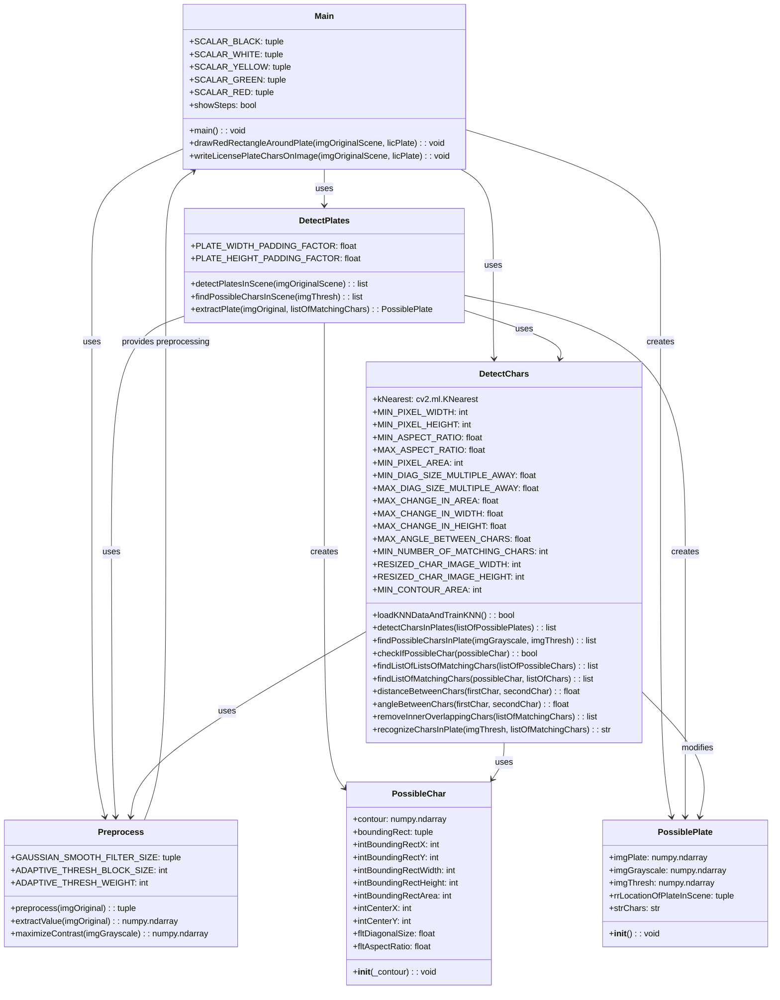
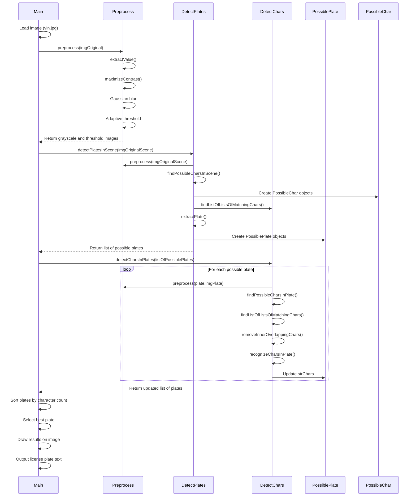
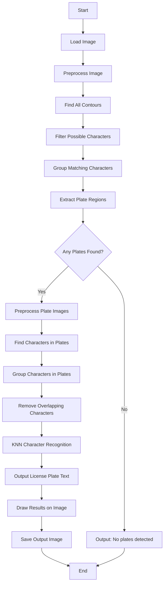
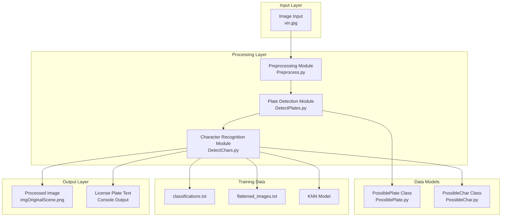
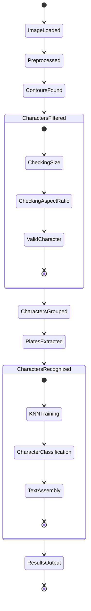
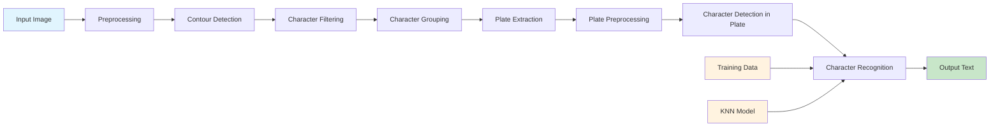
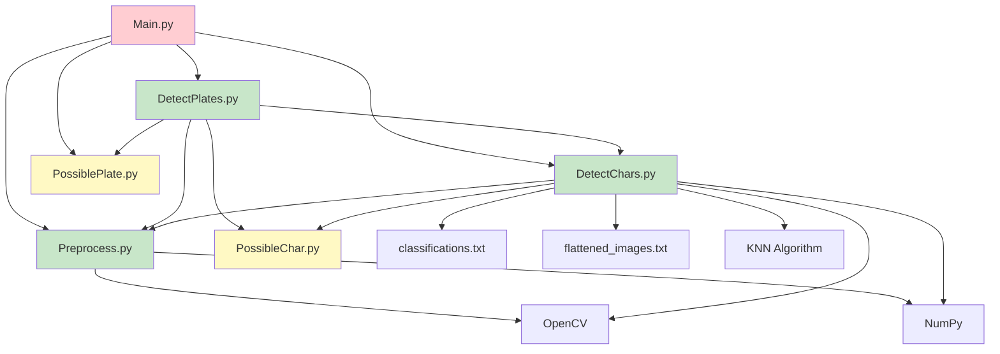

# Sơ Đồ UML: Hệ Thống Nhận Dạng Biển Số Xe

## 1. Class Diagram

## 2. Sequence Diagram - Luồng Xử Lý Chính

## 3. Activity Diagram - Quy Trình Xử Lý

## 4. Component Diagram

## 5. State Diagram - Trạng Thái Xử Lý

## 6. Data Flow Diagram

## 7. Module Dependencies

